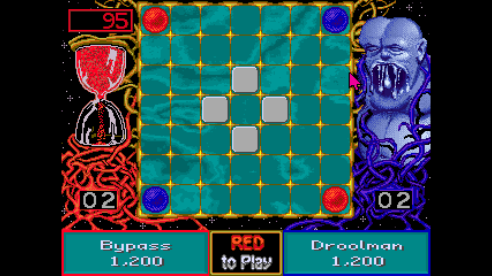

# Assegnazione Progetto

## Ataxx

Ataxx può essere giocato da solo due giocatori. 

L'obiettivo di Ataxx è avere più pedine del proprio colore sul tabellone alla fine del gioco.

- Il gioco si svolge su una griglia quadrata, solitamente di 7x7 caselle.
- Ogni giocatore inizia con due pedine sul tabellone, poste agli angoli opposti.
- I giocatori si alternano muovendo una delle loro pedine per turno.
- Una pedina può essere mossa in una sola casella libera adiacente (orizzontalmente, verticalmente o diagonalmente) dividendo la pedina in due pezzi o può "saltare" a una casella libera che si trova a due posti di distanza nella stessa maniera senza dividere la pedina.
- Quando una pedina viene mossa in una casella adiacente a una o più pedine dell'avversario, quelle pedine vengono "convertite" e cambiano colore, diventando pedine del giocatore che ha effettuato la mossa.
- Se un giocatore non può muovere nessuna delle sue pedine, deve passare il turno all'avversario.

Il gioco termina quando tutte le caselle del tabellone sono occupate o nessuno dei due giocatori può effettuare una mossa valida. Vince chi ha più pedine del proprio colore del tabellone.