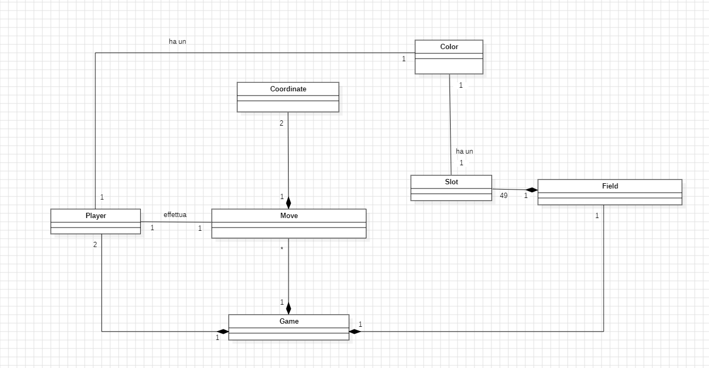
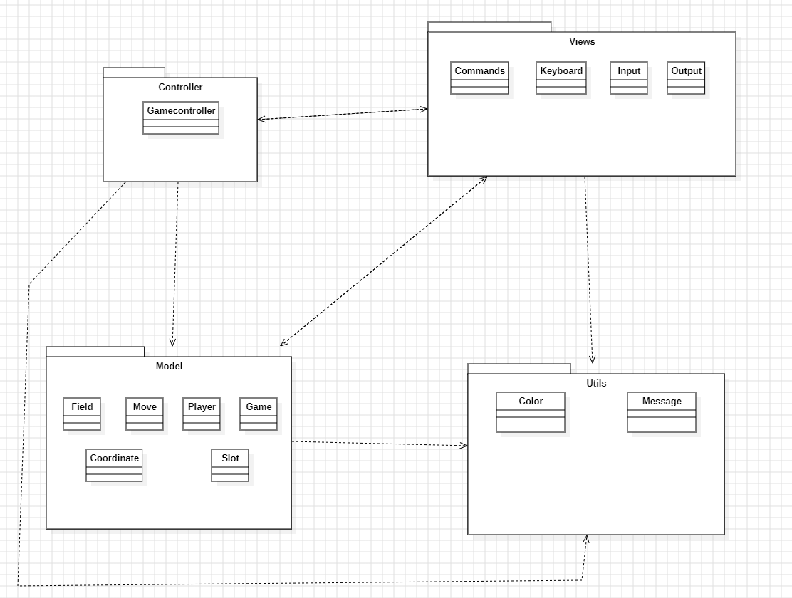
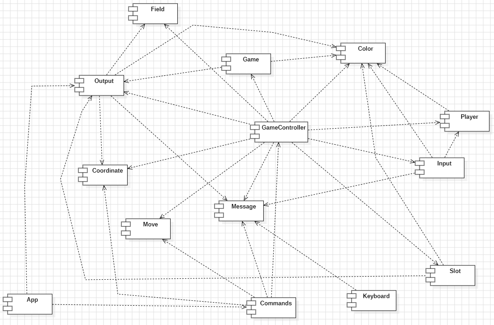
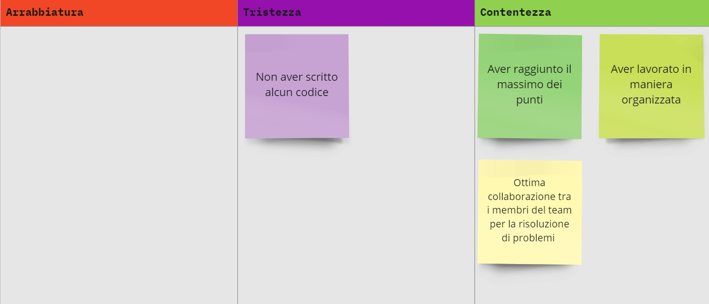
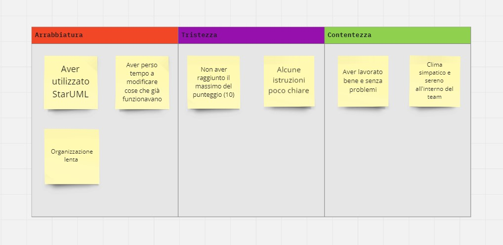

# Report
## Indice

---
[1. Introduzione](#1-introduzione)

[2. Modello di dominio](#2-modello-di-dominio)

[3. Requisiti specifici](#3-requisiti-specifici)

- [3.1 Requisiti funzionali](#31-requisiti-funzionali)
- [3.2 Requisiti non funzionali](#32-requisiti-non-funzionali)

[4. System Design](#4-system-design)

- [4.1 Stile architetturale adottato](#41-stile-architetturale-adottato)
- [4.2 Diagramma dei package](#42-diagramma-dei-package)
- [4.3 Diagramma dei componenti](#43-diagramma-dei-componenti)

[5. OO Design](#5-oo-design)

- [5.1 Diagramma delle classi](#51-diagramma-delle-classi)
- [5.2 Diagramma di sequenza](#52-diagramma-di-sequenza)

[6. Riepilogo dei test](#6-riepilogo-dei-test)

[7. Manuale utente](#7-manuale-utente)

[8. Processo di sviluppo e organizzazione del lavoro](#8-processo-di-sviluppo-e-organizzazione-del-lavoro)

[9. Analisi retrospettiva](#9-analisi-retrospettiva)

- [9.1 Sprint 0](#91-sprint-0)
- [9.2 Sprint 1](#92-sprint-1)
---

# **1. Introduzione**

Il seguente progetto riguarda la realizzazione del gioco Ataxx a riga di comando utilizzando Java. 
Ataxx è un gioco da tavolo strategico per due giocatori, i quali si sfidano su una griglia di 7x7.

In Ataxx, il gioco si svolge in turni alternati. Durante ogni turno, un giocatore potrà scegliere di:
- **Clonare** una pedina esistente in una cella adiacente vuota (muovendosi di una casella in qualsiasi direzione).
- **Spostare** una pedina esistente in una cella vuota che si trova entro una distanza di due celle.

Lo scopo del gioco è conquistare il maggior numero di celle possibili trasformando le pedine avversarie in proprie.

Il gioco termina quando non è più possibile effettuare mosse valide, il vincitore è il giocatore che ha conquistato il maggior numero di celle.

---

# **2. Modello di dominio**

Questo rappresentato è il modello di dominio del gioco Ataxx:

---

# **3. Requisiti specifici**
## 3.1 Requisiti funzionali

---

Il programma permette all'utente di creare una nuova partita con il comando ***`/gioca`***.

Una volta creata la partita, è possibile mostrare le mosse disponibili per il giocatore di turno con il comando ***`/qualimosse`***.

Il giocatore di turno può effettuare una mossa specificando la casella in cui è situata la pedina di partenza, seguita dalla casella in cui si desidera spostare la pedina.
Il formato con cui indicare la mossa che si intende effettuare è:
**`Aa-Bb`**

>**`A`**: è il carattere indicante la colonna della pedina di partenza. ***`[a...g]`**(lowercase)*
>
>**`a`**: è l'intero rappresentante la riga della pedina di partenza. ***`[1...7]`***
>
>**`-`**: carattere separatore. ***`[-]`***
>
>**`B`**: è il carattere indicante la colonna della casella di arrivo. ***`[a...g]`**(lowercase)*
>
>**`b`**: è l'intero rappresentante la riga della casella di arrivo. ***`[1...7]`***

Con il comando ***`/tavoliere`*** è possibile visualizzare la posizione attuale di tutte le pedine presenti sul campo da gioco.

È possibile vedere lo storico delle mosse effettuate dall'inizio della partita con il comando ***`/mosse`***, ed è inoltre possibile visualizzare il tempo trascorso dall'inizio della partita con il comando ***`/tempo`***.

Prima dell'inizio di una nuova partita, è possibile bloccare fino ad un massimo di 9 caselle, a scelta tra quelle sulla colonna D o sulla riga 4.
Una volta bloccata, la casella non può più essere sbloccata.
Il comando con cui indicare la casella da bloccare è:
***`/blocca Xy`***

>***`X`***: è il carattere indicante la colonna della casella da bloccare. ***`[a...g]`**(lowercase)*
>
>***`y`***: è l'intero rappresentante la riga della casella da bloccare. ***`[1...7]`***

Per visualizzare la plancia di gioco vuota, con le eventuali caselle bloccate, occorre usare il comando ***`/vuoto`***.

Per abbandonare una partita in corso, è possibile utilizzare il comando ***`/abbandona`***. In tal caso il giocatore avversario sarà decretato vincitore.

Per mostrare una schermata di aiuto, è possibile invocare l'applicazione con la flag **`--help`** o **`-h`**, oppure con il comando ***`/help`***.

Con il comando ***`/esci`*** è possibile terminare l'esecuzione del programma.

---

## 3.2 Requisiti non funzionali

---

Il programma è scritto utilizzando il linguaggio di programmazione Java, linguaggio indipendente dalla piattaforma hardware di esecuzione; ciò rende il programma multipiattaforma.

La sicurezza del programma è garantita con l'analisi statica del codice per mezzo del programma SpotBugs.

Sono stati effettuati test sul codice del programma, in modo da rendere il programma affidabile, scongiurando la presenza di errori di logica.

L'applicazione è distribuita come Container Docker.

---

# **4. System Design**
## 4.1 Stile architetturale adottato

---

Abbiamo utilizzato come pattern architetturale l'**Entity-Control-Boundary (ECB)**, 
in quanto è un pattern che permette di separare le responsabilità all'interno dell'applicazione, 
garantendo una maggiore manutenibilità e flessibilità:

### Entity
Rappresenta le classi che contengono i dati e le regole di business dell'applicazione:
- **Coordinate**
- **Field**
- **Game**
- **Move**
- **Player**
- **Slot**

### Boundary
Rappresenta le classi che interagiscono con l'utente:
- **App**
- **Input**
- **Keyboard**
- **Output**

### Control
Rappresenta le classi che contengono la logica dell'applicazione:
- **GameController**

---

## 4.2 Diagramma dei package

---

---

## 4.3 Diagramma dei componenti

---

---

# **5. OO Design**
## 5.1 Diagramma delle classi

---

---

## 5.2 Diagramma di sequenza

---

---

# **6. Riepilogo dei test**

---

# **7. Manuale utente**

---

Per poter avviare l'applicazione è necessario utilizzare docker,
il container docker dell’app deve essere eseguito da terminali che supportano Unicode con encoding UTF-8 o UTF-16.

**Comando per l’esecuzione del container**

Dopo aver eseguito il comando docker pull copiandolo da GitHub Packages, il comando Docker da usare per eseguire il container contenente l’applicazione è:
> docker run --rm -it ghcr.io/softeng2324-inf-uniba/ataxx-cocke:latest

Ataxx è un gioco da tavolo strategico per due giocatori, l'obiettivo è conquistare il maggior numero di celle possibili trasformando le pedine avversarie in proprie.

_Ecco i comandi disponibili per il giocatore:_
> - **/help** : Mostra l'elenco dei comandi.
> - **/gioca** : Crea una nuova partita se non ci sono partite in corso.
> - **/vuoto** : Mostra il tavoliere vuoto.
> - **/tavoliere** : Mostra la posizione delle pedine sul tavoliere.
> - **/qualimosse** : Mostra le mosse disponibili al giocatore.
> - **/mosse** : Mostra le mosse effettuate fino ad ora nella partita. 
> - **/blocca xn** : Blocca una casella xn, le pedine non possono arrivarci. 
> - **xn-xn** : Esegue una mossa con le cordinate nel formato (partenza-arrivo).
> - **/abbandona** : Chiude la partita in gioco e viene dichiarata vittoria all' avversario.
> - **/tempo** : Stampa il tempo passato dall'inizio della partita.
> - **/esci** : Esci dal gioco.

---

# **8. Processo di sviluppo e organizzazione del lavoro**

---

Nel team di sviluppo, è stato applicato il metodo di sviluppo software **SCRUM** per la gestione del progetto, seguendo il modello di sviluppo software **Agile**, che prevede lo sviluppo incrementale e iterativo del software. Il progetto è stato quindi suddiviso in 3 sprint, ognuno della durata di circa 2 settimane.

Ad ogni inizio sprint, si sono tenuti meeting di **Sprint Planning** con il **Product Owner Filippo Lanubile**, durante i quali sono stati definiti gli obiettivi dello sprint e assegnati i task al team.

Il nostro team di sviluppo è stato gestito da uno **Scrum Master**,il quale ha tenuto riunioni di **Daily Scrum Meeting** per monitorare lo stato di avanzamento del progetto.
Queste riunioni, della durata massima di 15 minuti, hanno seguito la prassi standard dove ogni membro del team ha risposto alle domande guida di **SCRUM**:
- *Cosa si è fatto ieri?*
- *Cosa si è fatto oggi?*
- *Ci sono problemi?*

Eventuali problemi emersi sono stati approfonditi in un momento successivo.

Inoltre abbiamo utilizzato in ogni sprint una **Scrum Board** fornita da GitHub, in cui abbiamo diviso i task in 5 colonne:

- **To Do**
- **In Progress**
- **Review**
- **Ready**
- **Done**

---

# **9. Analisi retrospettiva**

---

## 9.1 Sprint 0

---

---

## 9.2 Sprint 1

---

---