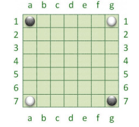
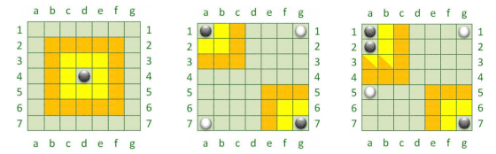

# Report
## Indice

---
[1. Introduzione](#1-introduzione)

[2. Modello di dominio](#2-modello-di-dominio)

[3. Requisiti specifici](#3-requisiti-specifici)

- [3.1 Requisiti funzionali](#31-requisiti-funzionali)
- [3.2 Requisiti non funzionali](#32-requisiti-non-funzionali)

[7. Manuale utente](#7-manuale-utente)

[9. Analisi retrospettiva](#9-analisi-retrospettiva)

- [9.1 Sprint 0](#91-sprint-0)

---

# **1. Introduzione**

Il seguente progetto riguarda la realizzazione del gioco Ataxx a riga di comando utilizzando Java. 
Ataxx è un gioco da tavolo strategico per due giocatori, i quali si sfidano su una griglia di 7x7.

In Ataxx, il gioco si svolge in turni alternati. Durante ogni turno, un giocatore potrà scegliere di:
- **Spostare** una pedina esistente in una cella adiacente vuota (muovendosi di una casella in qualsiasi direzione).
- **Clonare** una pedina esistente in una cella vuota che si trova entro una distanza di due celle.

Lo scopo del gioco è conquistare il maggior numero di celle possibili trasformando le pedine avversarie in proprie.

Il gioco termina quando non è più possibile effettuare mosse valide, il vincitore è il giocatore che ha conquistato il maggior numero di celle.

---

# **2. Modello di dominio**

Questo rappresentato è il modello di dominio del gioco Ataxx:
<!--  -->

---

# **3. Requisiti specifici**
## 3.1 Requisiti funzionali

---
>-E' stata abbozzata la relazione tecnica
>- Formato: Markdown
>- Dove: nel repository /docs/
>- Nome file: Report.md
>- Sezioni: 
   >   - 1.0. Introduzione;
   >   - 2.0. Modello di dominio;
   >   - 3.0. Requisiti specifici;
   >   - 3.1. Requisiti funzionali;
   >   - 3.2. Requisiti non funzionali;
   >   - 7.0. Manuale utente;
   >   - 9.0. Analisi retrospettiva;
   >   - 9.1. Sprint 0;

---

>- Criteri che devono essere soddisfatti per qualsiasi user story;
>- C'è un issue con label «user story»;
>- La issue è in un Milestone e in una Project Board;
>- Assegnazione a uno o al più due componenti del team;
>- I commit devono avere una descrizione breve ma significativa;
>- C'è una Pull Request (PR) che corrisponde alla user story;
>- La PR è in un Milestone ma non in una Project Board;
>- C'è un commento che linka la PR all'issue (es; "closes #22");
>- La PR è accettata a review avvenuto ed esplicito;
>- Build costruito con successo;
>- Docker image caricata con successo;
>- L'esecuzione rispetta i criteri di accettazione;

---

Le seguenti user story inizierebbero con Come Giocatore voglio ...

1. Voglio mostrare l'help con elenco comandi al comando **/help** o invocando l'app con flag --help o -h:
   il risultato è una descrizione concisa seguita dalla lista di comandi disponibili, uno per riga, come da esempio
   successivo: 
 - gioca
 - esci
 - ...

2. Voglio iniziare una nuova partita: al comando **/gioca**, se nessuna partita è in corso l'app mostra il tavoliere con le pedine in posizione iniziale come in figura e si
   predispone a ricevere la prima mossa di gioco del nero o altri comandi.

   

3. Voglio mostrare il tavoliere vuoto con la numerazione al comando **/vuoto** l'app mostra il tavoliere vuoto di 49 caselle quadrate (7 per lato) con le righe numerate da 1 a 7 e le colonne
   numerate da ‘a’ a ‘g’.

4. Voglio visualizzare le mosse possibili di una pedina al comando **/qualimosse** 
- se il gioco non è iniziato l'app suggerisce il comando gioca.
- se il gioco è iniziato l'app mostra quali mosse sono disponibili per il giocatore di turno, evidenziando:
  - a) in giallo le caselle raggiungibili con mosse che generano una nuova pedina
  - b) in arancione raggiungibili con mosse che consentono un salto
  - c) in rosa le caselle raggiungibili con mosse di tipo a) o b)
  
  

5. Voglio abbandonare la partita, al comando **/abbandona** l'applicazione chiede conferma:
- se la conferma è positiva, l'app comunica che il Bianco (o Nero) ha vinto per abbandono e dichiara come
  vincitore l’avversario per x a 0 dove x è il numero di pedine rimaste dell’avversario.
- se la conferma è negativa, l'app si predispone a ricevere nuovi tentativi o comandi.

6.  voglio chiudere il gioco al comando **/esci** l'applicazione chiede conferma:
- se la conferma è positiva, l'app si chiude restituendo il controllo al sistema operativo.
- se la conferma è negativa, l'app si predispone a ricevere nuovi tentativi o comandi

---

## 3.2 Requisiti non funzionali

---

Il container docker dell’app deve essere eseguito da terminali che supportano Unicode con encoding UTF-8 o UTF-16. 
**Elenco di terminali supportati Linux:**

- terminal

Windows 

- PowerShell
- Git Bash (in questo caso il comando Docker ha come prefisso winpty; es: winpty docker -it ....)

**Comando per l’esecuzione del container** Dopo aver eseguito il comando docker pull copiandolo da GitHub Packages, 
Il comando Docker da usare per eseguire il container contenente l’applicazione è:
> docker run --rm -it ghcr.io/softeng2324-inf-uniba/ataxx-base:latest 
 
dove *base* sarà sostituito con il nome del gruppo.

---

# **7. Manuale_utente**

---

Per poter avviare l'applicazione è necessario utilizzare docker,
il container docker dell’app deve essere eseguito da terminali che supportano Unicode con encoding UTF-8 o UTF-16.

**Comando per l’esecuzione del container**

Dopo aver eseguito il comando docker pull copiandolo da GitHub Packages, il comando Docker da usare per eseguire il container contenente l’applicazione è:
> docker run --rm -it ghcr.io/softeng2324-inf-uniba/ataxx-base:latest

Ataxx è un gioco da tavolo strategico per due giocatori, l'obiettivo è conquistare il maggior numero di celle possibili trasformando le pedine avversarie in proprie.

_Ecco i comandi disponibili per il giocatore:_
> - **/gioca** : Crea una nuova partita se non ci sono partite in corso.
> - **/vuoto** : Mostra il tavoliere vuoto.
> - **/tavoliere** : Mostra la posizione delle pedine sul tavoliere.
> - **/qualimosse** : Mostra le mosse disponibili al giocatore.
> - **/abbandona** : Chiude la partita in gioco e viene dichiarata vittoria all' avversario.
> - **/esci** : Esci dal gioco.

---

# **9. Analisi_retrospettiva**

---

<!-- inserire analisi retrospettiva -->

---

## 9.1 Sprint 0